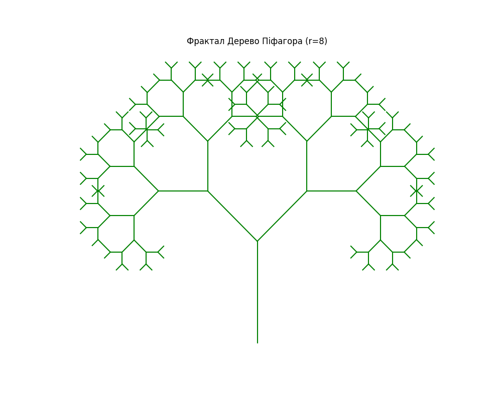
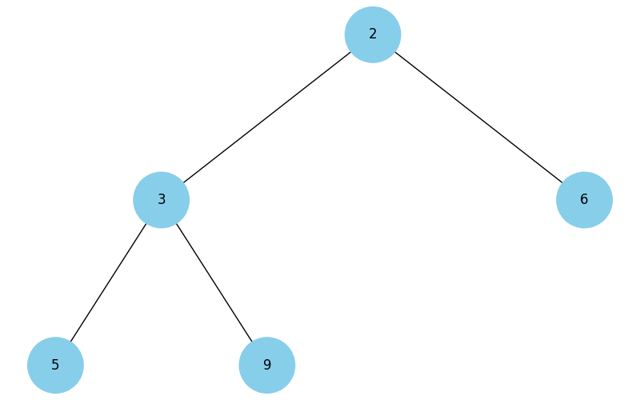
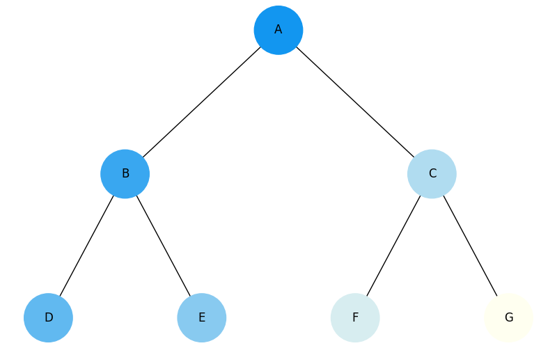
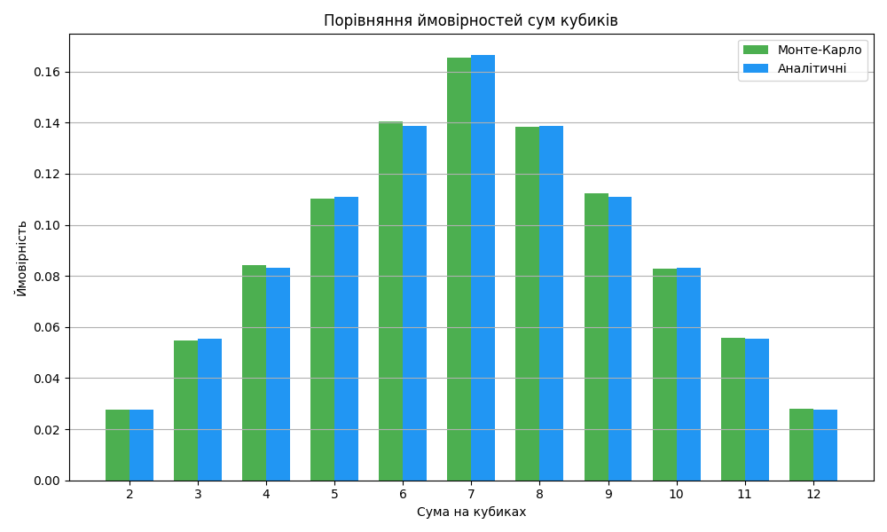

# Фінальний проєкт: Алгоритми та структури даних

Цей проєкт підсумовує всі теми курсу "Базові алгоритми та структури даних" через 7 практичних завдань.

---

## Завдання 1: Робота з однозв'язним списком
- Реалізовано структуру `Node`.
- Функції: `reverse_list`, `sort_linked_list`, `merge_sorted_lists`.
- Приклад виконання:
  ```
  === Тест реверсу ===
  1 -> 2 -> 3 -> 4
  4 -> 3 -> 2 -> 1
  === Тест сортування ===
  1 -> 2 -> 3 -> 4 -> 5
  === Тест злиття списків ===
  1 -> 2 -> 3 -> 4 -> 5 -> 6
  ```

---

## Завдання 2: Фрактал "Дерево Піфагора"
- Реалізовано рекурсивну функцію побудови фрактала.
- Користувач вводить рівень рекурсії.
- Приклад (рівень = 8):

  

---

## Завдання 3: Алгоритм Дейкстри
- Використано бінарну купу.
- Виведення найкоротших шляхів:
  ```
  До A: 0
  До B: 3
  До C: 2
  До D: 8
  До E: 10
  До Z: 13
  ```

---

## Завдання 4: Візуалізація бінарної купи
- Побудовано дерево на основі heapq.
- Візуалізація дерева:

  

---

## Завдання 5: Обхід дерева (DFS/BFS)
- Реалізовано обхід у глибину (stack) та ширину (queue).
- Колір змінюється від темного до світлого.
- ⚠️ Графіки відкриваються **по черзі**: другий з'являється лише після закриття першого.

  

---

## Завдання 6: Вибір їжі (жадібний + дин. прогр.)
- `greedy_algorithm` обирає продукти з найбільшим співвідношенням калорій/вартість.
- `dynamic_programming` — класичний рюкзак.
- Приклад:
  ```
  === Жадібний алгоритм ===
  cola, potato, pepsi, hot-dog
  === Динамічне програмування ===
  potato, cola, pepsi, pizza
  ```

---

## Завдання 7: Метод Монте-Карло
- Симуляція 100000 кидків кубиків.
- Порівняння з аналітичним розрахунком.
- Побудовано графік для ймовірностей:

  

---

## Висновки
У ході виконання фінального проєкту були:

- застосовані всі ключові теми курсу — від списків і дерев до жадібних алгоритмів і методу Монте-Карло;

- реалізовані як алгоритми, так і їх візуалізація, що покращує розуміння;

- проведено порівняння різних підходів (жадібний vs. динамічний, Монте-Карло vs. аналітика);

- підвищено навички структурованого кодування, аналізу та оптимізації рішень.

